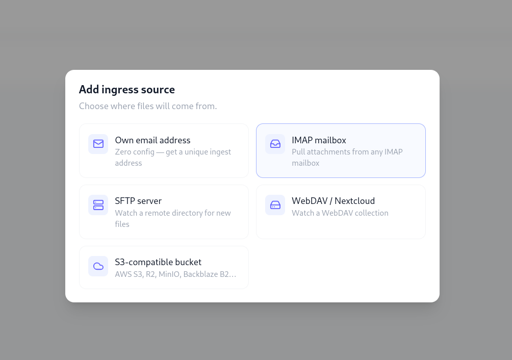
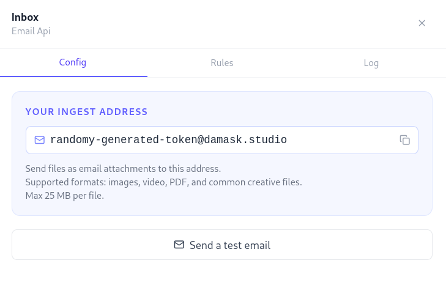
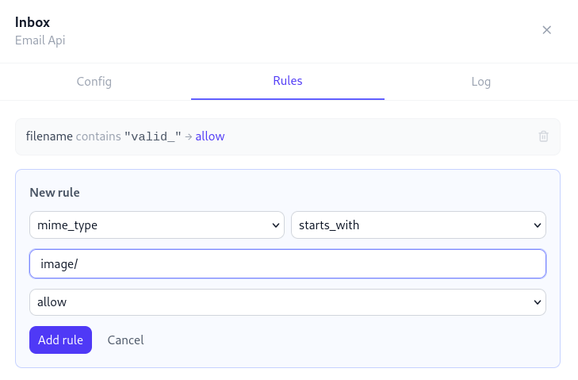

# Automatic Ingestion

Damask can pull assets from external sources on a schedule, so files flow into your library without manual importing. Connect a source once, point it at a destination project and folder, and let it run.



## How ingestion works

Each ingress source is polled on a configurable interval (default: every 15 minutes). When new files are found, Damask downloads them, validates their type and size, writes them to storage, and creates asset records - using the same pipeline as a manual upload. Thumbnails and metadata are extracted automatically.

A deduplication check runs before every import: if a file has been seen before (matched by a content hash), it's skipped silently. You won't get duplicate assets from a source that delivers the same file twice.

## Sources

### Personal ingest address

The easiest way to get files into Damask. Every workspace has a unique ingest email address:

```
ws_abc123@ingest.damask.studio
```

Find yours in **Settings → Ingestion → Email address**.

Email any file as an attachment to this address. The attachments appear in your target project within seconds. No configuration needed beyond choosing the default destination folder.



::: tip
Share this address with clients, collaborators, or your own devices. "Send to Damask" becomes a one-tap action from any email app.
:::

### IMAP mailbox

Connect Damask to any IMAP mailbox and watch it for attachments. Useful for a dedicated client delivery inbox or a shared team address.

**Required settings:**

| Field | Description |
|-------|-------------|
| Host | IMAP server hostname (e.g. `imap.gmail.com`) |
| Port | Usually `993` (TLS) |
| Username | Your email address |
| Password | Your password or app-specific password |
| Mailbox | The folder to watch (default: `INBOX`) |
| After import | What to do with processed messages: mark as read, move to a folder, or delete |

**Gmail / Google Workspace:** use an App Password, not your main account password. Generate one in Google Account → Security → App passwords.

**Filter by sender or subject:** optionally restrict which messages are processed. Only messages matching the filter are imported.

### SFTP server

Watch a directory on a remote server over SSH. Ideal for photographers using a remote upload tool, or for studio workflows where files land on a NAS or managed server.

**Required settings:**

| Field | Description |
|-------|-------------|
| Host | Server hostname or IP |
| Port | Usually `22` |
| Username | SSH username |
| Auth method | Password or SSH private key |
| Remote path | The directory to watch (e.g. `/uploads/incoming`) |
| After import | Leave in place, move to a done folder, or delete |

Private key authentication is recommended. Paste the PEM-encoded private key directly into the settings field - it is stored encrypted and never logged.

### WebDAV / Nextcloud

Connect to any WebDAV collection, including Nextcloud, ownCloud, or any WebDAV-compatible server.

**Required settings:**

| Field | Description |
|-------|-------------|
| URL | Full URL of the collection (e.g. `https://cloud.example.com/remote.php/dav/files/user/Uploads/`) |
| Username | Your account username |
| Password | Your password or app password |
| After import | Leave, move to another URL, or delete |

**Nextcloud:** generate an App Password in Nextcloud → Settings → Security → Devices & sessions. The DAV base URL format is `{nextcloud_url}/remote.php/dav/files/{username}/`.

### S3-compatible storage

Watch a bucket prefix on any S3-compatible object store.

**Supported providers:** AWS S3, Cloudflare R2, Backblaze B2, MinIO, Wasabi, and any other S3-compatible API.

**Required settings:**

| Field | Description |
|-------|-------------|
| Endpoint | Leave blank for AWS S3; enter the custom endpoint for R2/MinIO/B2 |
| Region | AWS region (e.g. `us-east-1`) |
| Bucket | The bucket name |
| Prefix | Only watch files under this key prefix (e.g. `incoming/`) |
| Access Key ID | Your access key |
| Secret Access Key | Your secret key |
| After import | Leave, move to another prefix, or delete |

Use path-style URLs (`use_path_style: true`) for MinIO and some self-hosted providers.

## Destinations

Each source is mapped to a **destination project** and an optional **destination folder**. All imported assets land there.

You can set up multiple sources pointing to the same project (e.g. an SFTP source and an email address both feeding into "Client Uploads") or multiple sources pointing to different projects.

## Ingestion rules

Rules let you route or filter files within a source based on their properties. Rules are evaluated in order - the first matching rule wins.

### Adding a rule

Go to a source's detail page and open the **Rules** tab. Click **+ Add rule**.

| Field | Options |
|-------|---------|
| If... | `mime_type`, `filename`, `sender`, `size_bytes`, `subject` |
| Operator | `equals`, `contains`, `starts_with`, `ends_with`, `gt`, `lt` |
| Value | The value to match against |
| Then... | `allow` (default), `deny` (skip this file), or `route to folder` |



### Example rules

- Route all PDFs to the `Briefs` folder: `mime_type starts_with application/pdf → route to folder: Briefs`
- Skip files over 500MB: `size_bytes gt 524288000 → deny`
- Only import from a specific client: `sender equals client@brand.com → allow`; add a second rule with no condition set to `deny` as a catch-all

### Rule order

Drag rules to reorder them. Rules are evaluated top to bottom. Add a catch-all `deny` rule at the bottom to default-reject everything that doesn't match an earlier `allow` rule.

## Ingestion log

Every import attempt is recorded in the ingestion log, viewable from each source's detail page.

| Status | Meaning |
|--------|---------|
| `imported` | File was downloaded and asset created successfully |
| `skipped` | File matched a `deny` rule, or was a duplicate |
| `failed` | Download or processing error (see error message) |
| `pending` | Queued, not yet processed |

Failed items can be retried individually from the log. The error message is shown in full - common causes include network timeouts, credential errors, and files that exceed the size limit.

## Polling interval

Each source has a configurable poll interval (5 min / 15 min / 30 min / 1 hour / 6 hours). The default is 15 minutes.

For S3 sources, near-realtime ingestion is available by configuring S3 event notifications to push to Damask's webhook endpoint - this reduces latency from the poll interval to seconds.

To trigger an immediate poll on any source, click **Poll now** on the source's detail page.

## Credentials security

All source credentials (passwords, API keys, private keys) are encrypted at rest using AES-256-GCM. They are never returned in API responses after initial save - the settings UI shows `***` in place of sensitive values.
