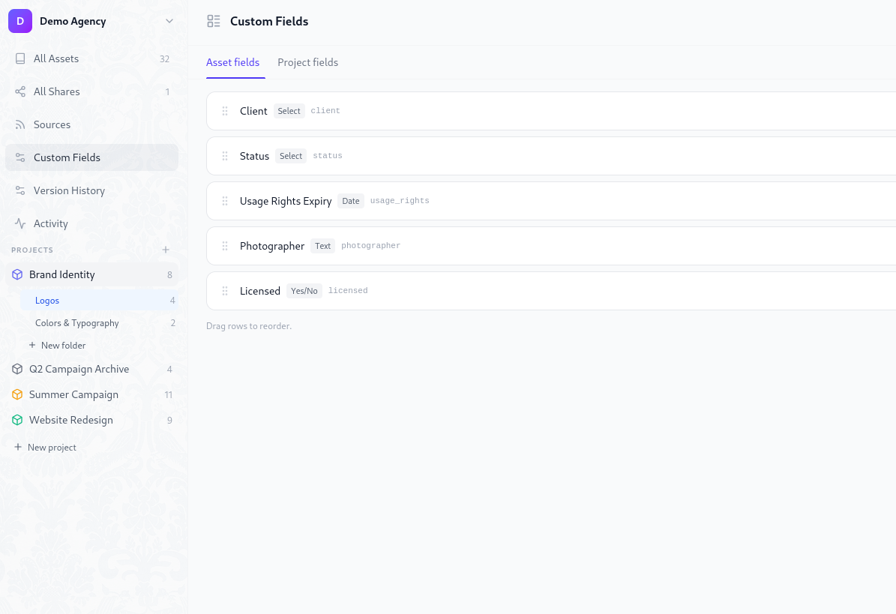

# Custom Metadata Fields

Damask lets you define your own metadata fields at the workspace level and fill them in per asset or per project. Fields are typed, filterable, and searchable - far more useful than free-text notes buried in a description.

## Field types

| Type | Stored as | Example use |
|------|-----------|-------------|
| **Text** | String | Client name, photographer, shoot location |
| **Number** | Decimal | Budget, print run, file count |
| **Date** | ISO date | Usage rights expiry, shoot date, deadline |
| **Yes / No** | Boolean | Approved, published, licensed |
| **Select** | String (from list) | Status, license type, campaign phase |
| **URL** | String | Brief link, reference, delivery URL |

## Managing field definitions

Go to **Settings → Custom fields** to create and manage field definitions.

Fields are defined once at the workspace level and then appear on every asset (or project, depending on scope). You define the schema; your team fills in the values.

### Creating a field

Click **+ Add field**. A two-step modal opens:

1. **Pick a type** - choose from the six types above. The type cannot be changed after creation.
2. **Configure the field**:
   - **Name** - the display label shown in the UI (e.g. "Usage Rights Expiry")
   - **Key** - auto-generated from the name as a URL-safe slug (e.g. `usage_rights_expiry`). Read-only after creation.
   - **Required** - a soft nudge shown in the UI; does not block uploads.
   - **Options** - for Select fields only, define the list of allowed values.

::: tip
The field key is immutable after creation. It's used in filter URLs and API queries, so changing it would break any saved links. Choose a clear, stable name before saving.
:::

### Editing a field

You can rename a field and update its options at any time. The key and type are permanently locked.

For Select fields, you can add new options freely. Removing an option does not retroactively invalidate assets that already have that value - they keep their existing value, but the removed option no longer appears in the dropdown for new entries.

### Deleting a field

Deleting a field definition soft-deletes it - the definition is hidden immediately, but the values stored on assets are retained for 30 days before being permanently purged. This gives you time to recover from accidental deletions.

A confirmation dialog shows how many assets have values set for that field before you confirm.

### Reordering fields

Drag fields in the settings list to reorder them. The order here controls the display order in the asset detail panel.

## Filling in field values

### On a single asset

Open any asset's detail panel (click the asset in the library grid). The **Custom fields** section appears below the standard metadata. Click any field to edit it inline:

- **Text / URL** - click to activate an inline input, save on `Enter` or blur
- **Number** - number input, saves on blur
- **Date** - opens a date picker popover
- **Yes / No** - toggle switch, saves immediately
- **Select** - dropdown showing the defined options

Unsaved fields show an "Add value" placeholder. Fields with a value show the value with a small edit icon.

### On a project

Open a project's detail page. Custom fields scoped to **projects** appear in the project info panel. Same inline editing behaviour.

### Bulk fill

Select multiple assets in the library grid and use **Set field** from the bulk action bar. This opens a field picker and value input. The value is applied to all selected assets at once.

## Field inheritance from project

Fields can optionally inherit their value from the project they belong to. When **Inherit to new assets** is enabled on a field definition, any asset newly added to a project automatically receives that project's value for that field as a default.

The inherited value can be overridden per asset at any time.

This is useful for fields like `client` or `campaign` that are the same for every asset in a project - set it once on the project and all new assets pick it up automatically.

## Filtering by field values

The library filter panel includes a **Custom fields** section. Each active field definition shows a filter control appropriate to its type:

- **Text / URL** - text input with debounce, matches substrings
- **Number** - min/max range inputs
- **Date** - from/to date range picker
- **Yes / No** - three-state toggle (any / yes / no)
- **Select** - checkbox list of options (OR logic within the field, AND logic across fields)

Active field filters appear as dismissible chips in the filter bar alongside tag chips. A combined filter might look like: `client: Nike` + `status: Approved` + `usage_rights: before Jan 1 2027`.

## Field scope

Fields are either **asset-scoped** (appear on individual assets) or **project-scoped** (appear on projects). Both are defined in the same Settings → Custom fields page, separated into two tabs.

A project-scoped field like `phase` (Discovery / Production / Delivery / Archived) describes the project as a whole. An asset-scoped field like `approved` describes an individual file.
