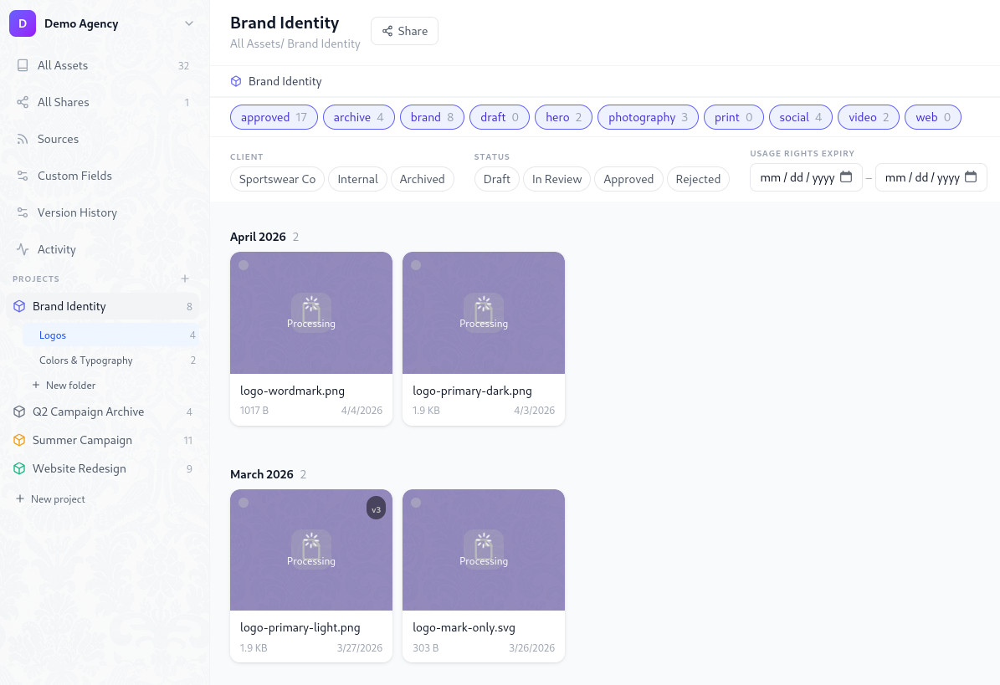
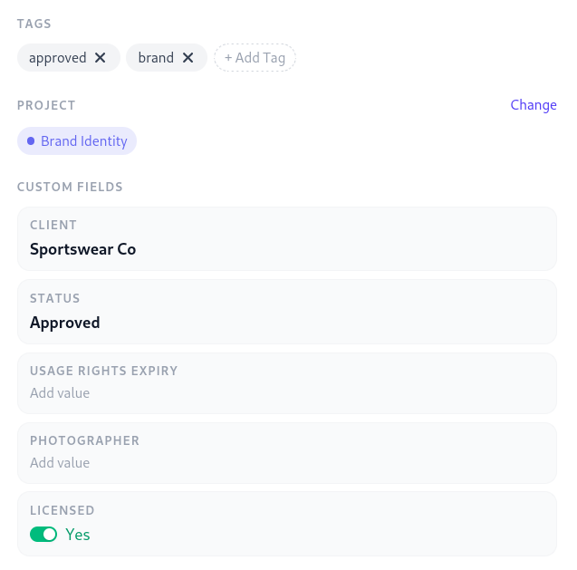
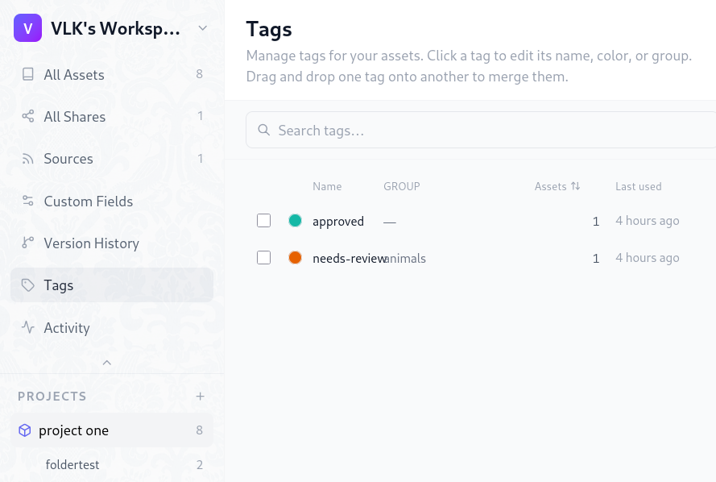
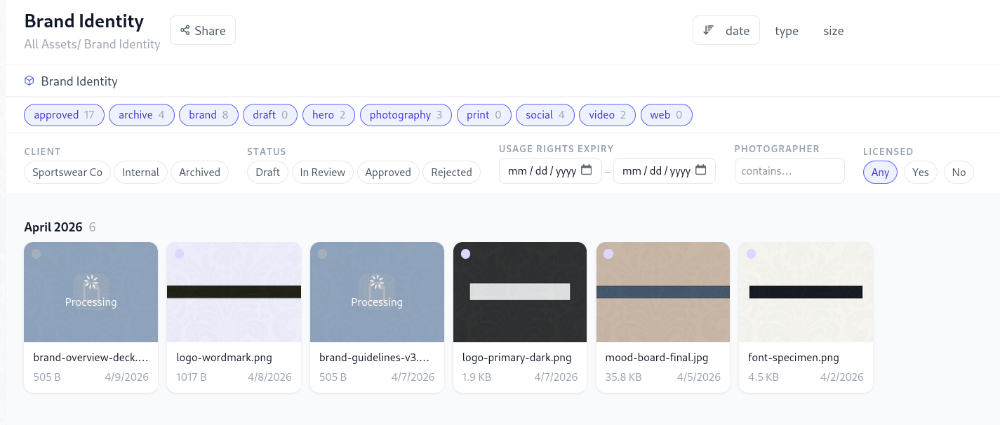

# Projects, Folders & Tags

Damask organises your assets around three complementary layers: **projects** group work by client or campaign, **folders** create structure within a project, and **tags** let you cross-cut across everything with freeform labels.



## Projects

A project is the top-level container for a body of work. Every asset belongs to exactly one project (or to no project, living at the workspace root).

### Creating a project

Click **+ New project** in the left sidebar. Each project has:

- **Name** - shown in the sidebar and on asset cards
- **Color** - a dot indicator used in the sidebar and breadcrumbs
- **Cover image** - optionally set any asset as the project's visual identity
- **Description** - a free-text note visible on the project detail page

### Setting a project icon or cover

Open the project detail page and click the cover area at the top. A picker lets you select any asset already in the project, or upload a new one directly. The chosen asset is version-pinned - uploading a new version of that asset won't silently change the icon.

### Deleting a project

Deleting a project does **not** delete its assets. Assets are moved to the workspace root (no project). This is intentional - assets are not owned by projects, only associated with them.

## Folders

Folders live inside a project and provide up to two levels of nesting. This covers the vast majority of real creative workflows without creating the navigation complexity of infinite depth.

### Creating a folder

Right-click any project in the sidebar and choose **New folder**, or open the project and click **+ Folder** in the header. You can also create a subfolder by right-clicking an existing folder.

### Depth limit

Damask enforces a maximum of two folder levels:

```
Project
|
└── Root folder          ← level 1
|
└── Root folder          ← level 1
    |
    └── Subfolder        ← level 2 (deepest allowed)
```

This is a deliberate product constraint, not a technical limitation. If you find yourself needing a third level, it's usually a sign the work should be split into separate projects.

### Moving assets into folders

Drag one or more assets from the grid onto any folder in the sidebar. The folder highlights on hover. Drop to move. You can also select assets and use **Move to folder** from the bulk action bar.

### Viewing all assets in a project

Click the project name in the sidebar (not a specific folder) to see all assets across all folders in that project at once.

## Tags

Tags are workspace-scoped labels that can be applied to any asset regardless of which project it belongs to. Unlike folders, a single asset can have multiple tags.

### Applying tags

Open any asset's detail panel and type in the tag field. Tags are created on first use - no pre-registration needed. Press `Enter` or comma to confirm each tag. A maximum of 20 tags per asset is enforced.



### Filtering by tags

The tag filter bar appears below the search input in the library. Click a tag chip to filter. Hold `Shift` and click a second tag to add it to the filter (AND logic - only assets matching all selected tags are shown). Click an active tag chip again to remove it from the filter.

### Bulk tagging

Select multiple assets in the grid using `Shift+click` or the checkbox that appears on hover. The bulk action bar appears at the bottom of the screen. Choose **Add tag** to apply a tag to all selected assets at once.

### Removing a tag

Open an asset's detail panel and click the `×` on any tag chip. To remove a tag from multiple assets at once, use bulk select and **Remove tag** from the bulk action bar.

### Tag management

The Settings → Tags page lists all workspace tags with their asset counts. From here you can rename a tag (updates all assets) or delete it (removes the tag from all assets - assets themselves are unaffected).



## Search

The search bar in the header runs a full-text search across asset filenames, tag names, project names, and all text-type custom metadata fields.

Search is debounced - results update as you type after a short pause. The library grid updates in place; you don't leave the current view.



### Combining search with filters

Search and tag filters work together. You can search for `"hero"` while also filtering by the `approved` tag - only assets matching both conditions appear.

### Keyboard shortcut

Press `/` from anywhere in the library to focus the search input.
