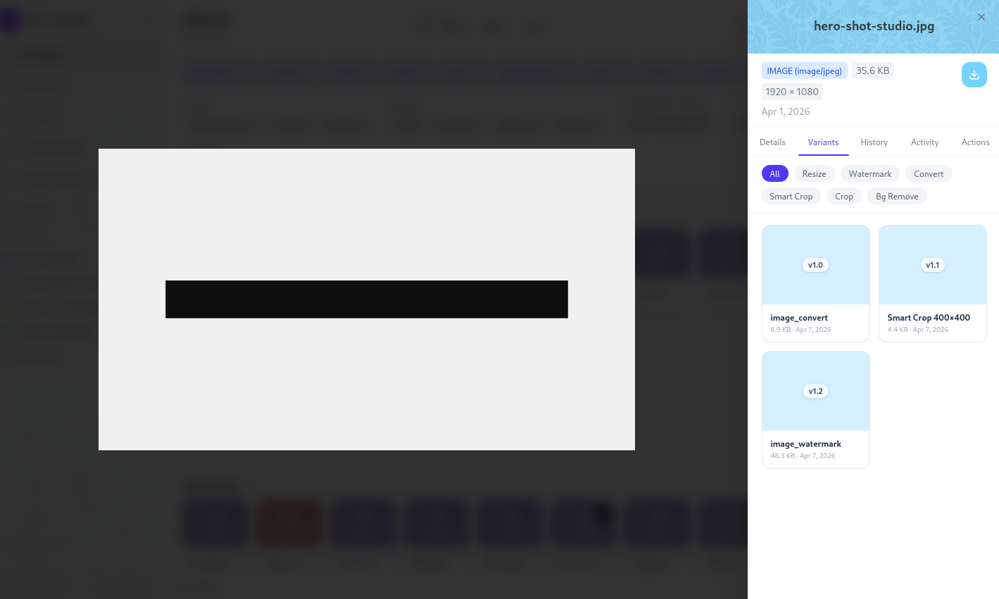

# Transforms & Variants

Damask can resize, convert, crop, watermark, and process assets without leaving the app. Every transformed file is stored as a **variant** - a linked derivative of the original. Your source files are never modified.

## What is a variant?

A variant is a processed version of an asset, linked to the original. It has its own file (stored separately in your storage backend), its own download URL, and a record of the transformation parameters used to produce it.

Variants are visible in the asset detail panel under the **Variants** tab. Deleting a variant removes the derived file - the original is unaffected.

## Creating a variant

Open the asset detail panel and click **Create variant**. A panel opens with tabs for each transform type. Configure the parameters and click **Create** - the job runs in the background and the variant appears in the list when ready.

A live preview updates as you adjust settings (debounced - it recalculates after you stop moving a slider). The preview is a small WebP thumbnail, not the full output.

## Transform types

### Resize

Produce an image at a specific width and height.

| Parameter | Options |
|-----------|---------|
| Width | Any integer (px) |
| Height | Any integer (px), or leave blank to scale proportionally |
| Fit | `cover` - fill the box, crop the excess |
| | `contain` - fit inside the box, letterbox if needed |
| | `fill` - stretch to fill exactly (no cropping, may distort) |
| Quality | 1–100 (JPEG / WebP only) |
| Format | JPEG, PNG, WebP, AVIF |

::: tip
Leave height blank and set only the width to resize proportionally - the original aspect ratio is preserved.
:::

### Convert

Change the file format without resizing.

Supported output formats for images: **JPEG**, **PNG**, **WebP**, **AVIF**.

For video: **MP4** (H.264 + AAC), **WebM** (VP9).

Quality and codec settings are available where applicable.

### Crop

Select a region of an image to export.

An interactive crop overlay appears on the asset preview. Drag the handles to adjust the selection. Optionally lock to a specific aspect ratio:

- Free - any dimensions
- Square (1:1)
- Landscape (16:9, 4:3, 3:2)
- Portrait (9:16, 3:4, 2:3)
- Custom - enter a ratio directly (e.g. `7:3`)

The output dimensions shown update live as you drag.

### Background removal

Remove the background from an image, producing a PNG with a transparent background.

This transform uses the Remove.bg API by default. To use it, add your API key in **Settings → Integrations → Remove.bg**.

If no API key is configured, Damask falls back to a local background removal model (RMBG-1.4) when available, or shows a prompt to configure the integration.

::: info Offline use
The local RMBG-1.4 model requires a one-time download on first use. Once downloaded, background removal works entirely offline with no API key needed. Model downloads are managed in Settings → Integrations.
:::

### Video thumbnail extraction

Extract a still frame from a video file as a JPEG or WebP image.

| Parameter | Description |
|-----------|-------------|
| Timestamp | Seconds from the start, or a percentage (e.g. `0.5` for halfway) |
| Format | JPEG or WebP |
| Quality | 1–100 |

### Video transcoding

Produce a web-ready copy of a video at a different resolution or format.

| Parameter | Options |
|-----------|---------|
| Format | MP4 (H.264), WebM (VP9) |
| Resolution | Original, 1080p, 720p, 480p, 360p |
| Strip audio | Yes / No |

::: warning
Video transcoding is the most resource-intensive operation. Damask limits concurrent transcoding jobs to 2 to avoid saturating the server. Large files may take several minutes. You'll see a progress indicator on the variant card.
:::

### Watermark

Overlay a text or image watermark on a photo or video.

| Parameter | Description |
|-----------|-------------|
| Type | Text or image (upload a PNG) |
| Text content | The string to render (for text watermarks) |
| Position | 9 anchor positions (corners, edges, center) |
| Opacity | 0–100% |
| Size | Relative to the output width (5–50%) |

---

## Managing variants

### Variants tab

The **Variants** tab in the asset detail panel lists all variants with:

- Type badge (resize, convert, crop, bg_remove, thumbnail, transcode, watermark)
- Output dimensions and file size
- Transform parameters (hover to expand)
- Creation date
- Download button
- Delete button

### Downloading a variant

Click the download icon on any variant row, or use the API endpoint directly. Variants are served from your storage backend - the same location as original files.

### Deleting a variant

Click the delete icon on a variant row. The derived file is removed from storage. The original asset is unaffected. Deletion is immediate and permanent - there is no soft-delete for variants.

### Bulk variant creation (coming soon)

Select multiple assets in the library grid and choose **Create variant** from the bulk action bar. Configure the transform once and apply it to all selected assets. This is useful for batch-exporting a project at a consistent web size or format.

## Transform preview endpoint

The live preview in the variant creation panel is powered by a dedicated preview endpoint that runs transforms in memory - no files are written to storage until you confirm. The preview is capped at 800px on the longest edge to keep it fast.

Results are cached briefly in memory (LRU, 100 entries) so dragging a slider repeatedly doesn't re-run the same transform.
