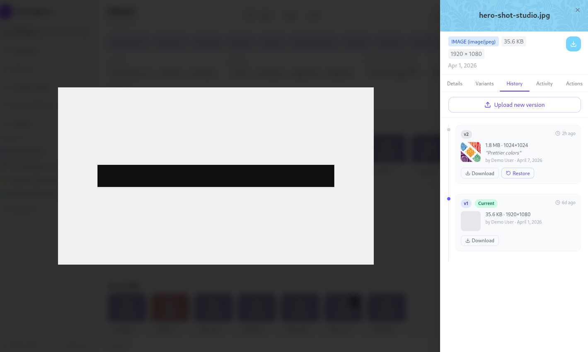
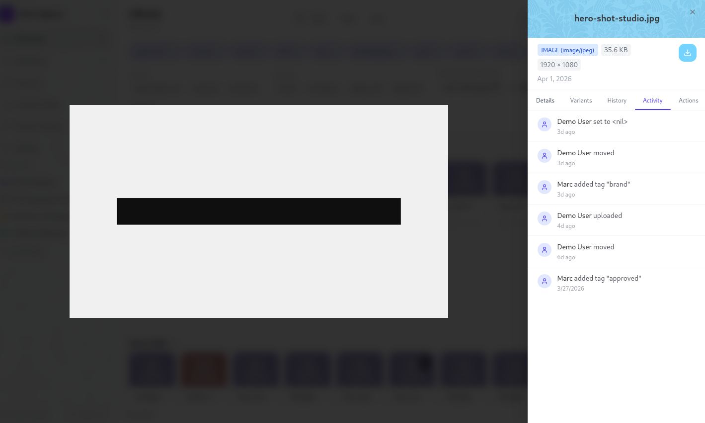
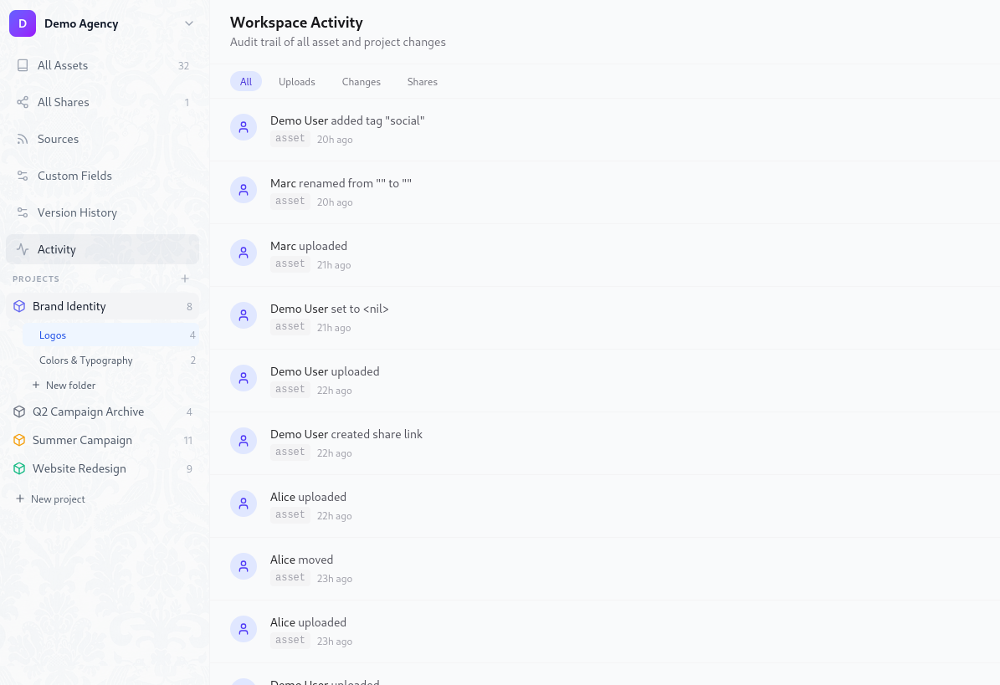

# Version History & Audit Log

Damask tracks two distinct kinds of change: **binary versions** (when the file itself changes) and **metadata events** (when anything else changes - a rename, a tag, a field value, a share). Together they give you a complete, tamper-evident record of every asset's life.

## Version history

### How versions work

Every asset in Damask has an identity (its `id`) that never changes, and a version history that grows over time. When you upload a new version of a file, the original is preserved. The asset's name, project, tags, and custom fields remain unchanged - only the file bytes change.

Versions are numbered monotonically: v1, v2, v3… Numbers are never reused, even if intermediate versions are deleted.

### Uploading a new version

Open the asset detail panel and click **Upload new version** in the header. A minimal upload modal opens:

- Drop zone (single file - new versions are always one file at a time)
- Optional **comment** field ("What changed in this version?")

The file type should match the original's category - you'll see a warning if you replace a JPEG with an MP4, though Damask won't block it.

After upload, the new version becomes current immediately. The old version is preserved in the history tab.

### Viewing version history

Open the asset detail panel and click the **History** tab. Each version shows:

- Version number badge (`v3`, `v2`, `v1`)
- Thumbnail
- File size and dimensions
- Upload comment (if set)
- Uploader name and relative timestamp
- A **current** badge on the active version

### Rolling back to a previous version

Click **Restore** on any non-current version. A confirmation dialog appears showing who uploaded that version and its comment. Confirm to restore.

Rolling back is **non-destructive**. The version you roll back from is not deleted - it stays in the history and can be restored again at any time.

::: warning
If a version is being used as a project icon or workspace icon, it cannot be deleted. You'll see a warning explaining which project references it. Update the icon first, then delete the version.
:::

### Deleting a version

Click **Delete** on any non-current version (owners only). You cannot delete the current version - restore another version first, then delete the one you want to remove.

Deletion is a soft delete. The file is retained for a grace period before being physically removed from storage.

### Version retention policy

By default, all versions are kept indefinitely. You can configure a retention cap in **Settings → Workspace → Version history**: choose to keep the last N versions per asset (1–50). A nightly job soft-deletes versions beyond the cap. The setting change takes effect on the next scheduled run.

A warning is shown if the new cap is lower than the current maximum version count across your workspace.

## Content deduplication

If you upload a file that is byte-for-byte identical to an existing version of the same asset, Damask detects this and returns a `409 Conflict` with the message "This file is identical to the current version." No duplicate storage is written.

## Activity log

The activity log is an append-only record of every meaningful event on an asset or project. Unlike version history (which tracks file changes), the activity log tracks metadata changes: renames, tag additions, field value updates, share link creation, ownership transfers, and more.

### Viewing the activity log

Open the asset detail panel and click the **Activity** tab. Events are listed newest first, each showing:

- Actor avatar and name (or "system" for automated events)
- A human-readable description of what changed
- Relative timestamp

Events from the same actor within a 5-minute window are grouped into a collapsed entry ("Alice made 3 changes - 2 hours ago"). Click to expand.

### Event types

| Event | What it records |
|-------|----------------|
| Uploaded | New asset or new version, with version number |
| Renamed | Old and new filename |
| Moved | Origin and destination project/folder |
| Tagged / Untagged | Tag name |
| Field set | Field name, old value, new value |
| Field cleared | Field name and removed value |
| Version restored | Which version was restored and from which |
| Shared | Share link created, expiry if set |
| Share revoked | Share link ID |
| Downloaded | Via direct download or share link |
| Deleted / Restored | Soft delete and recovery |

### System events

Some events are generated by Damask automatically, not by a human action. These include:

- Assets ingested from an ingress source (shows the source name)
- Thumbnail generation completion
- Version purges from the retention policy

System events appear in the log with an italicised "system" actor label.

### Project activity

The project detail page has its own **Activity** tab showing events scoped to that project - both project-level changes (renames, field updates, archived status) and a summary of recent asset activity within the project.

### Workspace-wide feed

The main dashboard includes a **Recent activity** panel showing the 20 most recent events across your entire workspace. Filter by actor, event type, or project. Refreshes every 60 seconds.

## Exporting the activity log

Go to **Settings → Export → Activity log** to download a CSV of all workspace events within a date range. Columns include event type, asset name, actor, timestamp, and a plain-text summary.

This is useful for client billing documentation, project post-mortems, or compliance evidence ("here is a full record of every change made to these deliverables").
